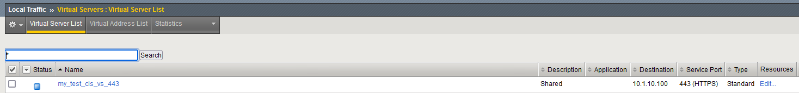
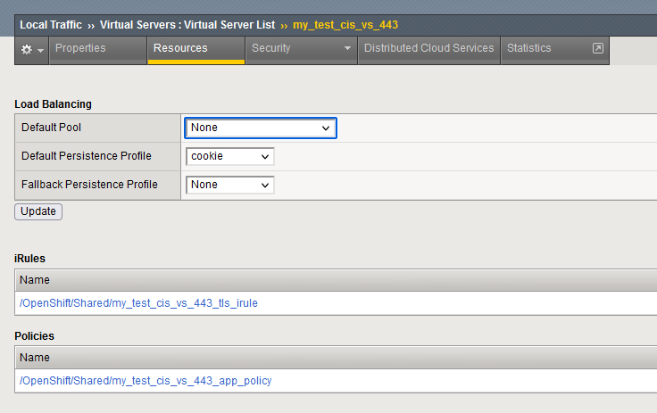

# TLS Passthrough

`app.yaml` deploys an NGINX pod listening on port `8443` with TLS enabled.

Configuring the Route with `spec.tls.termination: passthrough` creates the following on BIG-IP:

1. A virtual server listening on port 443
    
1. An iRule that performs SNI routing without terminating the TLS connection on the BIG-IP
    

Performing a request to the BIG-IP VS reveals the server certificate returned by the app (the certificate loaded on the app is generated by `mkcert` in this example), not by BIG-IP.

```
 curl -vvv -k --resolve backend.example.com:443:10.1.10.100 https://backend.example.com
* Added backend.example.com:443:10.1.10.100 to DNS cache
* Rebuilt URL to: https://backend.example.com/
* Hostname backend.example.com was found in DNS cache
*   Trying 10.1.10.100...
* Connected to backend.example.com (10.1.10.100) port 443 (#0)
* ALPN, offering h2
* ALPN, offering http/1.1
* Cipher selection: ALL:!EXPORT:!EXPORT40:!EXPORT56:!aNULL:!LOW:!RC4:@STRENGTH
* successfully set certificate verify locations:
*   CAfile: /etc/pki/tls/certs/ca-bundle.crt
  CApath: none
* TLSv1.2 (OUT), TLS header, Certificate Status (22):
* TLSv1.2 (OUT), TLS handshake, Client hello (1):
* TLSv1.2 (IN), TLS handshake, Server hello (2):
* TLSv1.2 (IN), TLS handshake, Certificate (11):
* TLSv1.2 (IN), TLS handshake, Server key exchange (12):
* TLSv1.2 (IN), TLS handshake, Server finished (14):
* TLSv1.2 (OUT), TLS handshake, Client key exchange (16):
* TLSv1.2 (OUT), TLS change cipher, Client hello (1):
* TLSv1.2 (OUT), TLS handshake, Finished (20):
* TLSv1.2 (IN), TLS change cipher, Client hello (1):
* TLSv1.2 (IN), TLS handshake, Finished (20):
* SSL connection using TLSv1.2 / ECDHE-RSA-AES256-GCM-SHA384
* ALPN, server accepted to use http/1.1
* Server certificate:
*        subject: O=mkcert development certificate; OU=leon@5NNS0F3
*        start date: Feb 13 23:50:52 2024 GMT
*        expire date: May 14 00:50:52 2026 GMT
*        issuer: O=mkcert development CA; OU=leon@5NNS0F3; CN=mkcert leon@5NNS0F3
*        SSL certificate verify result: unable to get local issuer certificate (20), continuing anyway.
> GET / HTTP/1.1
> Host: backend.example.com
> User-Agent: curl/7.47.1
> Accept: */*
>
< HTTP/1.1 200 OK
< Server: nginx/1.25.3
< Date: Wed, 14 Feb 2024 00:30:51 GMT
< Content-Type: text/plain
< Content-Length: 5
< Connection: keep-alive
<
* Connection #0 to host backend.example.com left intact
Hello
```