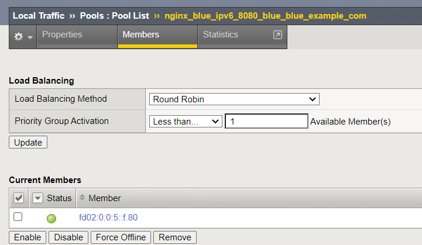
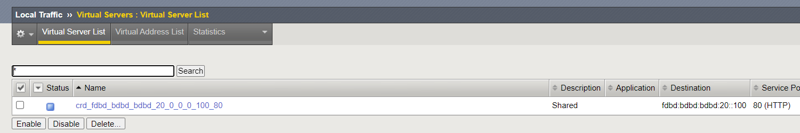

# IPv6 test for CIS 2.11 (CRD mod) on OpenShift 4.11 with OVN-Kubernetes CNI

## Setup

- CIS 2.11
- OpenShift 4.11 with dual stack enabled
- [OVN-Kubernetes with F5 BIG-IP routes](https://github.com/mdditt2000/k8s-bigip-ctlr/tree/7c7150e02351a6376376e586c9ec39ac43e6286c/user_guides/ovn-kubernetes-standalone), i.e. without VXLAN
    > side note: I was able to get traffic working without the `k8s.ovn.org/routing-external-gws: <big-ip IP>` annotation in the application namespace
- CRD mode enabled

## Results

IPv6 service and pod deployed:
```
$ oc -n blue describe pod nginx-blue-5598669b4f-65d9m | grep "  IP:"
  IP:           10.128.2.15
  IP:           fd02:0:0:5::f
$ oc -n blue describe svc nginx-blue-ipv6 | grep Endpoints
Endpoints:                [fd02:0:0:5::f]:80
$ oc -n blue get vs
NAME      HOST               TLSPROFILENAME   HTTPTRAFFIC   IPADDRESS                     IPAMLABEL   IPAMVSADDRESS   STATUS   AGE
blue-vs   blue.example.com                                  fdbd:bdbd:bdbd:20:0:0:0:100               None            Ok       17m
```

Confirm that CIS is able to:

- target BIG-IP URL with IPv6 address
- discover and populate pods with IPv6 addresses as BIG-IP pool members
    
- create BIG-IP VS with IPv6 listener
    


